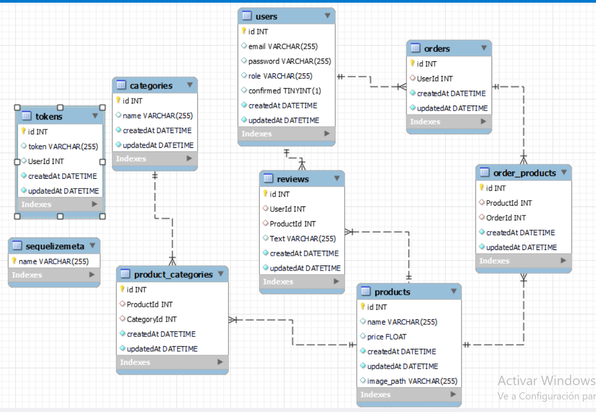

# README de proyecto Backend con sequelize

Este repositorio contiene un proyecto de backend con uso de base de datos para creacion de Usuario con pedidos, productos, categorias y criticas.

## Características
- **Configuracion:** En la carpeta de configuracion tendremos un archiv js en el que debereis poner vuestra configuracion de base de datos, tambien tendremos un archivo que usaremos para poder mandar emails cuando el usuario se registre.

- **Controladores:** Existiran controladores de todas las tablas, para crear endpoints tanto para crear, modificar, recojer y eliminar.(CRUD)

- **Middleware:** Tendremos una carpeta llamada middleware la cual almacenara 3 archivos necesarios, el primero sera authentication y lo usaremos para agregarselo a la ruta necesaria para que sea necesario un token de usuario para usarla. El segundo archivo sera para mostrar los errores pertinentes cuando no se realice una conexion correctamente. Y el ultimo sera el multer, que lo usaremos para agregar imagenes a los productos desde tu ordenador.

- **Modelos:** Se crearan los modelos necesarios para unir las tablas y agregarles los campos necesarios a ellas, con sus respectivas caracteristicas.

- **Rutas:** Tendremos una carpeta llamada routes la cual almacenara todas las rutas de nuestro proyecto, cada ruta servira para algo distinto y se le podra implementar el authentication si queremos que las usen solo los usuarios logeados y el isAdmin que forzara a ser usada solo por los usuarios con el rol de Admin o SuperAdmin.

- **Seeders:** Habra una carpeta de seeders la cual usaremos para crear 5 seeders para productos, para que sea mas comodo el uso de la tabla, y que no sea necesario el crearlos a mano.

- **Tests:** Generaremos 6 tests, uno para el registro del usuario, otro para la comprobacion por correo de el, para el login, para una creacion de producto , mostrar los productos y el logout.

- **Package.json:** Este archivo servira para poder ejecutar con los scripts de manera comoda el proyecto y los tests.

- **Base de datos:** La base de datos tendra 5 tablas (usuarios, criticas, pedidos, productos y categorias) y 2 intermedias (categorias_productos, productos_pedidos).

- **Relaciones:** (Usuarios 1-N Pedidos),(Pedidos N-M Productos),(Productos N-M Categorias),(Usuarios 1-N Criticas),(Productos 1-N Criticas).

